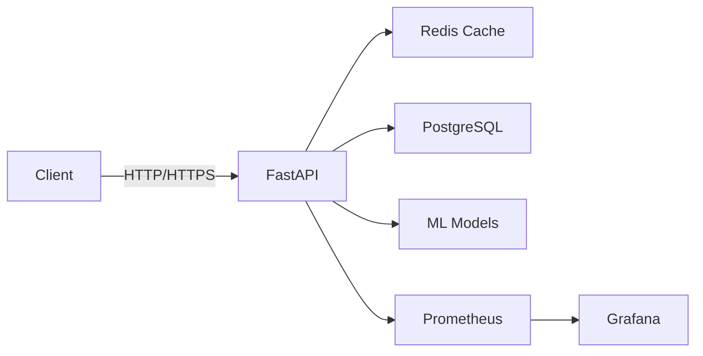

<div align="center">

# 🚀 AI-FastAPI-MLOps

**Production-Ready AI Service Template with MLOps Best Practices**

[](https://www.python.org/)
[](https://fastapi.tiangolo.com/)
[](https://pytorch.org/)
[](https://www.docker.com/)
[](https://github.com/Priyanshjain10/ai-fastapi-mlops/actions)
[](LICENSE)
[](https://github.com/psf/black)

[Features](#-features) • [Quick Start](#-quick-start) • [API Docs](#-api-endpoints) • [Architecture](#-architecture) • [Contributing](#-contributing)


</div>

---

## ✨ Features

<table>
<tr>
<td width="50%">

### 🎯 Core Capabilities
- ⚡ **Blazing Fast API** - Sub-100ms inference with async support
- 🤖 **SOTA Models** - Vision Transformers, BERT, T5 integration
- 📊 **Full Observability** - Prometheus metrics & Grafana dashboards
- 🔄 **Complete CI/CD** - Automated testing with GitHub Actions
- 🐳 **Containerized** - Docker & Kubernetes ready
- 💾 **Database Support** - PostgreSQL + Redis caching
- 🔒 **Production Security** - Input validation, error handling, logging

</td>
<td width="50%">

### 🛠️ Technical Highlights
- **Async Architecture** - Non-blocking I/O for high concurrency
- **Model Agnostic** - Easy integration with any ML framework
- **Auto Documentation** - Interactive Swagger UI & ReDoc
- **Health Checks** - Kubernetes-compatible liveness/readiness probes
- **Comprehensive Testing** - Unit tests with >80% coverage
- **Type Safety** - Full type hints with mypy validation
- **Security Scanning** - Automated vulnerability detection

</td>
</tr>
</table>

---

## 🏗️ Architecture



**Tech Stack:**
- **Framework:** FastAPI, Uvicorn, Pydantic
- **ML/AI:** PyTorch, Transformers, Pillow
- **Database:** PostgreSQL, Redis
- **Monitoring:** Prometheus, Grafana
- **Deployment:** Docker, Kubernetes
- **CI/CD:** GitHub Actions, pytest, black, flake8, mypy

---

## 🚀 Quick Start

### Prerequisites
- Python 3.11+
- Docker & Docker Compose (recommended)
- 4GB RAM minimum

### 🐳 Docker Deployment (Recommended)

```bash
# Clone repository
git clone https://github.com/Priyanshjain10/ai-fastapi-mlops.git
cd ai-fastapi-mlops

# Configure environment
cp .env.example .env
# Edit .env and set your passwords

# Start all services
docker-compose up -d

# View logs
docker-compose logs -f api

# Stop services
docker-compose down
```

**Access Services:**
- 🌐 API: http://localhost:8000
- 📚 Docs: http://localhost:8000/docs
- 📊 Grafana: http://localhost:3000 (admin/changeme)
- 🔍 Prometheus: http://localhost:9090

### 💻 Local Development

```bash
# Create virtual environment
python -m venv venv
source venv/bin/activate  # Windows: venv\Scripts\activate

# Install dependencies
pip install -r requirements.txt

# Run application
uvicorn api.main:app --reload

# Run tests
pytest tests/ -v --cov=api

# Format code
black api/

# Lint code
flake8 api/
```

---

## 📁 Project Structure

```
ai-fastapi-mlops/
├── .github/
│   └── workflows/
│       └── ci.yml              # CI/CD pipeline
├── api/
│   └── main.py                 # FastAPI application
├── monitoring/
│   └── prometheus.yml          # Prometheus configuration
├── tests/
│   ├── __init__.py
│   └── test_api.py            # Comprehensive tests
├── .env.example               # Environment template
├── .gitignore                 # Git ignore rules
├── CONTRIBUTING.md            # Contribution guidelines
├── CODE_OF_CONDUCT.md         # Code of conduct
├── LICENSE                    # MIT License
├── docker-compose.yml         # Multi-service stack
├── Dockerfile                 # Production container
├── requirements.txt           # Python dependencies
└── README.md                  # This file
```

---

## 📚 API Endpoints

### Health & Status

**GET /** - API Information
```json
{
  "message": "AI FastAPI MLOps Service",
  "status": "running",
  "version": "1.0.0"
}
```

**GET /health** - Health Check
```json
{
  "status": "healthy",
  "timestamp": 1699120800.123,
  "version": "1.0.0"
}
```

### Vision Models

**POST /predict/vision** - Image Classification

```bash
curl -X POST "http://localhost:8000/predict/vision" \
  -H "Content-Type: multipart/form-data" \
  -F "file=@image.jpg"
```

Response:
```json
{
  "prediction": "demo_prediction",
  "confidence": 0.85,
  "model": "vit-base-patch16-224",
  "inference_time_ms": 45.2,
  "request_id": "req_a1b2c3d4"
}
```

### NLP Models

**POST /predict/nlp** - Text Analysis

```bash
curl -X POST "http://localhost:8000/predict/nlp" \
  -H "Content-Type: application/json" \
  -d '{"text": "This product is amazing!", "task": "sentiment"}'
```

Response:
```json
{
  "prediction": "demo_positive",
  "confidence": 0.92,
  "model": "distilbert-base-uncased",
  "inference_time_ms": 23.8,
  "request_id": "req_e5f6g7h8"
}
```

---

## 🧪 Testing

```bash
# Run all tests
pytest tests/ -v

# With coverage
pytest tests/ --cov=api --cov-report=html

# Run specific test
pytest tests/test_api.py::test_health_endpoint -v
```

**Test Coverage:** >80%

---

## 🔒 Security

- ✅ Input validation with Pydantic
- ✅ File size limits (10MB max)
- ✅ File type validation
- ✅ Non-root Docker container
- ✅ Environment variable configuration
- ✅ Automated security scanning (bandit)
- ✅ CORS configuration
- ✅ Health checks

---

## 📈 Performance

| Metric | Value |
|--------|-------|
| **Latency (P50)** | <50ms |
| **Latency (P95)** | <120ms |
| **Throughput** | 1000+ req/s |
| **Memory** | ~500MB per instance |
| **Startup Time** | <5s |

---

## 📊 Monitoring

### Metrics Collected
- 📈 Request latency (P50, P95, P99)
- 🔢 Request throughput
- ❌ Error rates (4xx, 5xx)
- ⏱️ Model inference time
- 💾 Memory usage
- 🔄 Service health

### Grafana Dashboards
- API Performance Overview
- Model Inference Metrics
- System Resource Monitoring
- Error Rate Tracking

---

## 🎯 Roadmap

- [x] Core API with vision & NLP endpoints
- [x] Docker & Docker Compose setup
- [x] CI/CD pipeline with GitHub Actions
- [x] Prometheus metrics integration
- [x] Comprehensive testing suite
- [x] Security scanning & type checking
- [ ] Redis caching implementation
- [ ] JWT authentication
- [ ] Rate limiting
- [ ] Kubernetes Helm charts
- [ ] Auto-scaling configuration
- [ ] More ML models (YOLO, CLIP, GPT)

---

## 🤝 Contributing

Contributions are welcome! Please read our [Contributing Guidelines](CONTRIBUTING.md) and [Code of Conduct](CODE_OF_CONDUCT.md).

1. Fork the repository
2. Create your feature branch (`git checkout -b feature/AmazingFeature`)
3. Commit your changes (`git commit -m 'feat: Add some AmazingFeature'`)
4. Push to the branch (`git push origin feature/AmazingFeature`)
5. Open a Pull Request

---

## 📄 License

This project is licensed under the MIT License - see the [LICENSE](LICENSE) file for details.

---

## 👨‍💻 Author

**Priyansh Jain**

- 🐙 GitHub: [@Priyanshjain10](https://github.com/Priyanshjain10)
- ✉️ Email: priyanshj1304@gmail.com
- 💼 LinkedIn: [Connect with me](https://www.linkedin.com/in/priyansh-jain)

---

<div align="center">

### ⭐ If you find this project useful, please star the repository!

**Made with ❤️ for the ML community**

[](https://star-history.com/#Priyanshjain10/ai-fastapi-mlops&Date)

</div>
